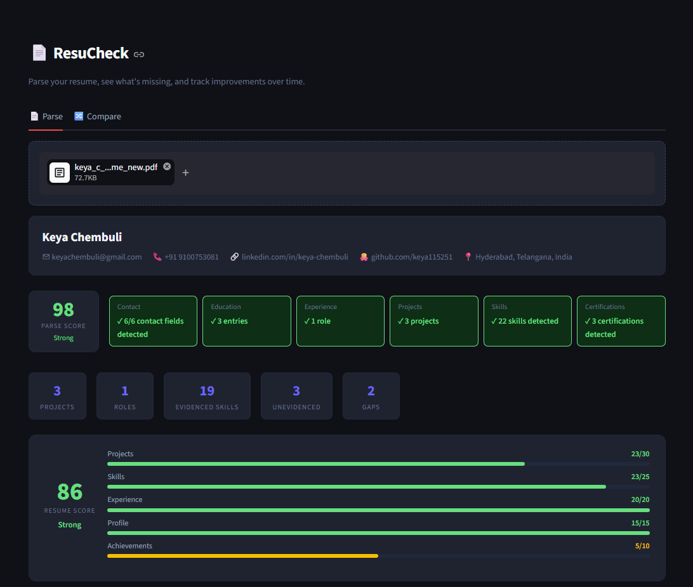
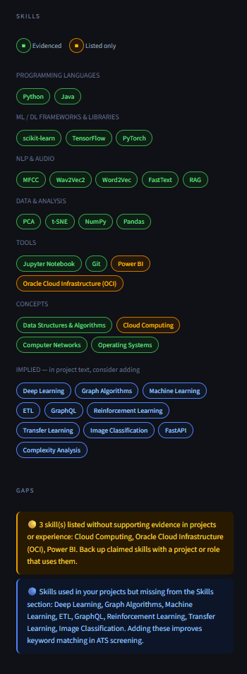
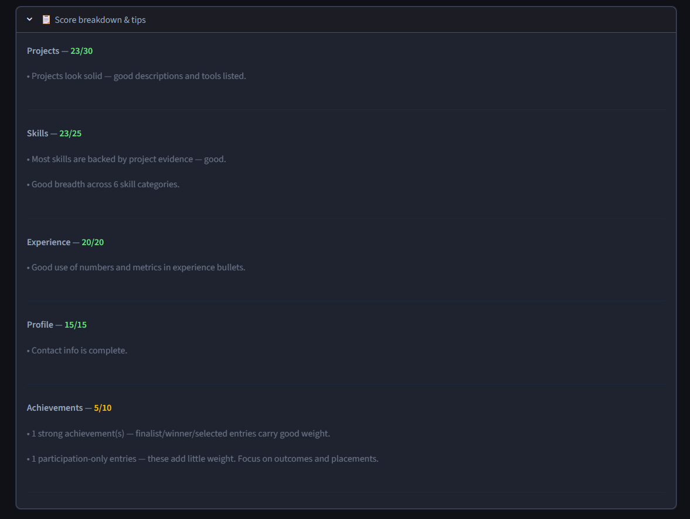
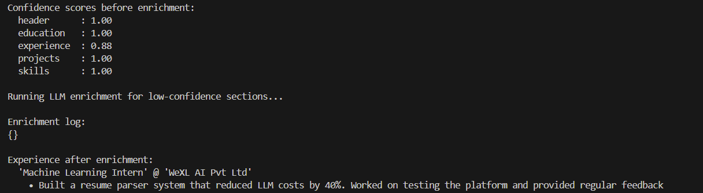

# Resume Parser

A local, offline resume parser built for engineering students — extracts structured data from PDF/DOCX resumes, scores resume quality, detects gaps, and verifies projects against GitHub. No API keys required for the core pipeline; this fork adds an optional local LLM fallback via Ollama for low-confidence sections.

<!-- IMAGE 1: Hero screenshot — full Parse tab view showing the quality score card,
     metric strip, and a parsed resume's sections. This is the first thing visitors
     see, so pick a resume with good data across all sections (high score, GitHub
     verified, no major gaps) to show the tool at its best. -->



## Why I built this

Most resume parsers are tuned for Western/corporate resume formats and treat every résumé the same way regardless of engineering branch. This one is built specifically for Indian engineering student resumes — handling the section-naming conventions, CGPA formats, and multi-branch skill taxonomies (CS, Mechanical, Civil, Electrical, Electronics, Biotech, IT, Cybersecurity) that generic parsers get wrong. It started as a deliverable for an AI internship and grew into a personal project once I started adding the LLM fallback layer.

## What it does

- **Extracts structured data** from PDF and DOCX resumes — header, education, experience, projects, skills, certifications, achievements, languages, leadership, extracurriculars
- **Handles messy PDFs** — LaTeX/Overleaf exports with missing spaces, two-column layouts, split headers (`E DUCATION` → `EDUCATION`)
- **Scores resume quality** (0–100) across five dimensions — project depth, skill credibility, experience quality, profile completeness, achievements — with field-aware weighting so a Mechanical Engineering resume isn't scored by CS standards
- **Detects gaps** with branch-specific, actionable advice (no generic "add more skills" — it tells you exactly what's missing and why it matters for your field)
- **Verifies projects against GitHub** using multi-signal matching (name similarity, description overlap, tech stack overlap) — confirms whether claimed projects actually exist publicly
- **Compares resume versions** — upload two parses and see what improved, what regressed, and which gaps got resolved
- **Falls back to a local LLM (Ollama)** for sections the rule-based parser struggles with — primarily Experience, which is the hardest section to parse reliably with regex alone

<!-- IMAGE 2: Score breakdown screenshot — the "Score breakdown & tips" expander
     open, showing the per-dimension scores and explanation text. Demonstrates
     that the scoring isn't a black box. -->


## Architecture

```
PDF/DOCX
   │
   ▼
extractor.py / docx_extractor.py    — character-level extraction, space reconstruction,
   │                                   two-column detection, split header merging
   ▼
segmenter.py                         — 7-signal section detection, 200+ header aliases
   │
   ▼ (fallback for unrecognised headers)
section_classifier.py                — embedding-based classification (sentence-transformers)
   │
   ▼
entity_extractor.py                  — per-section parsers (header, education, experience,
   │                                   projects, skills, certifications, achievements...)
   ▼
skill_enricher.py                    — 444-skill taxonomy across 9 engineering fields,
   │                                   evidence classification (listed vs. evidenced)
   ▼
assembler.py                         — gap detection, confidence scoring, quality scoring,
   │                                   final JSON assembly
   ▼
github_enricher.py (optional)        — GitHub project verification, non-blocking
   │
   ▼
llm_enricher.py (optional, this fork) — Ollama re-extraction for low-confidence sections
   │
   ▼
Structured JSON output
```

## The Ollama fallback layer

This is the part that distinguishes this fork from the base parser. Rule-based extraction is fast and deterministic but struggles with unstructured prose — particularly the Experience section, where bullet formatting varies wildly between resumes.

Rather than running every resume through an LLM (slow, and unnecessary when the rule-based parser already does well), this fork computes a **per-section confidence score** during parsing. Sections below a threshold (default 0.6) get routed to a local Ollama model (`llama3.1:8b`) for re-extraction. The LLM output is **merged**, never substituted. Rule-based fields are kept whenever they're present and reasonable; the LLM only fills in what the rule-based parser left empty or clearly garbled.

```python
from assembler import parse_resume

result = parse_resume("resume.pdf", use_llm=True, llm_threshold=0.6)
```

This requires Ollama running locally:
```bash
ollama pull llama3.1:8b
```

<!-- IMAGE 3: Optional — terminal screenshot of llm_enricher.py running standalone,
     showing the before/after confidence scores and enrichment log. Demonstrates
     the LLM fallback is real and measurable, not just a feature claim. -->


## Tech stack

- **Parsing**: pdfplumber, pdfminer.six, python-docx
- **ML**: sentence-transformers (all-MiniLM-L6-v2), PyTorch, scikit-learn
- **LLM fallback**: Ollama (llama3.1:8b), requests
- **UI**: Streamlit
- **External data**: GitHub REST API (no auth required)

## Running it

```bash
pip install -r requirements.txt
streamlit run app.py
```

For LLM fallback, also run:
```bash
ollama pull llama3.1:8b
```

## Project structure

```
resume-parser/
├── extractor.py            # PDF extraction
├── docx_extractor.py        # DOCX extraction
├── segmenter.py              # Section detection
├── section_classifier.py     # Embedding fallback classifier
├── entity_extractor.py       # Entity parsing per section
├── skill_enricher.py         # Skill taxonomy and evidence scoring
├── assembler.py               # Gap detection, scoring, final assembly
├── github_enricher.py         # GitHub project verification
├── llm_enricher.py            # Ollama fallback (this fork)
├── app.py                      # Streamlit UI
└── requirements.txt
```

## Known limitations

- Scanned/image-based PDFs aren't supported — no OCR layer
- Very non-standard templates with no recognisable section headers will under-parse
- The LLM fallback requires Ollama running locally; without it, the parser degrades gracefully to rule-based only

## License

MIT
